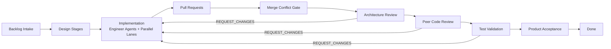

# Autonomous Delivery System
## Test Policy and Type Errors

Main workspace tests are prioritized for CI/CD, release, and quality assurance. Type errors in test files (e.g., test_workflow_engine.py, test_escalation_workflow.py) are suppressed with `# type: ignore` comments when they do not affect runtime or test results. These suppressed errors are documented and do not block builds or releases.

Sandboxed/parallel test failures are reviewed periodically but do not block main development unless required by process or stakeholders. Focus is maintained on keeping the main workspace clean and documented.

For full type safety, suppressed errors can be addressed, but this is not required for production unless strict compliance is needed.

This project is maintained in the GitHub repository [obizues/Autonomous-Delivery-Team](https://github.com/obizues/Autonomous-Delivery-Team) on the `main` branch.

Version: **v0.5.0**


Autonomous Delivery System enables multi-agent, demo-ready, fully automated software delivery workflows with step-by-step visual playback, live event feed, artifact/PR drilldown, and robust test isolation.

**Status:** All tests passing (v0.5.0, multi-agent workflow, step-by-step replay, live event feed, artifact drilldown, robust test isolation, demo-ready UI)

See docs/ROADMAP.md and docs/V0_4_CROSS_REPO_AUTONOMY_BACKLOG.md for planning and backlog.

## Maintainer
- Owner: obizues
- Branch: main

## Why This Matters

- Demonstrates how autonomous delivery can stay auditable, deterministic, and review-driven.
- Shows practical patterns for multi-agent coordination, not just single-agent code generation.
- Bridges autonomous implementation with governance gates, escalation, and human intervention.
- Provides a concrete reference implementation for agentic SDLC experimentation.

## Why This Matters

- Demonstrates how autonomous delivery can stay auditable, deterministic, and review-driven.
- Shows practical patterns for multi-agent coordination, not just single-agent code generation.
- Bridges autonomous implementation with governance gates, escalation, and human intervention.
- Provides a concrete reference implementation for agentic SDLC experimentation.

## What This Project Does


- Branch: main
See the chat for the current TODO plan and project steps.
- Owner: obizues

## Workflow Stages

`BACKLOG_INTAKE → PRODUCT_DEFINITION → REQUIREMENTS_ANALYSIS → ARCHITECTURE_DESIGN → IMPLEMENTATION → PULL_REQUEST_CREATED → MERGE_CONFLICT_GATE → ARCHITECTURE_REVIEW_GATE → PEER_CODE_REVIEW_GATE → TEST_VALIDATION_GATE → PRODUCT_ACCEPTANCE_GATE → DONE`

## Quick Architecture Diagram



## Quick Start

### 1) Create environment and install dependencies

```powershell
python -m venv .venv
.venv\Scripts\activate
pip install -r requirements.txt
```

### 2) Run acceptance scenarios

```powershell
$env:PYTHONPATH='src'
python scripts/demo_acceptance.py
```

### 3) Launch dashboard (workflow + UI)

```powershell
.venv\Scripts\python.exe ui/launcher.py
```

### 4) UI only

```powershell
.venv\Scripts\python.exe ui/launcher.py --ui-only
```

## Common Commands

- Run escalation demo:
  - `python ui/launcher.py --escalation-demo`
- Run resume e2e test:
  - `python scripts/demo_resume_e2e.py`
- Run engine directly:
  - `python -m ai_software_factory`
- Run dashboard directly:
  - `streamlit run ui/app.py`

## Repository Layout

```text
autonomous_delivery/
├── src/ai_software_factory/   # Core engine, agents, workflow, persistence
├── ui/                         # Streamlit dashboard and launcher
├── scripts/                    # Acceptance and escalation demo scripts
├── seed_repos/                 # Seed scenarios used by the engine
├── docs/                       # Architecture and operational docs
├── CHANGELOG.md                # Release history
├── VERSION                     # Current release version
└── requirements.txt            # Python dependencies
```

## Documentation

- Architecture: `docs/ARCHITECTURE.md`
- Requirements: `docs/REQUIREMENTS.md`
- Getting Started: `docs/GETTING_STARTED.md`
- Operations Runbook: `docs/OPERATIONS.md`
- Contributing: `docs/CONTRIBUTING.md`
- Roadmap: `docs/ROADMAP.md`
- Release Notes: `docs/RELEASE_NOTES_v0.2.0.md`
- Screenshots Guide: `docs/SCREENSHOTS.md`
- Changelog: `CHANGELOG.md`


## Import and Launch Conventions

### UI and Streamlit App Imports

- All UI modules (in `ui/`) use **local imports** (e.g., `from config import ...`) to ensure compatibility when launching from the `ui` directory.
- Package modules (in `src/ai_software_factory/`) use **absolute imports** (e.g., `from ai_software_factory.orchestration import ...`).
- Always launch UI scripts (including Streamlit) from the `ui` directory to avoid `ModuleNotFoundError`.
- If launching Streamlit, use:
  - `cd ui`
  - `streamlit run app.py`
- If launching via Python, use:
  - `.venv\Scripts\python.exe launcher.py`
- Ensure `PYTHONPATH` is set to `src` if launching from the root directory.
- All directories must contain `__init__.py` files for package recognition.

### Troubleshooting Imports

- If you encounter `ModuleNotFoundError`, verify:
  - You are launching from the correct directory (`ui` for UI/Streamlit).
  - Import style matches the module location (local for UI, absolute for packages).
  - `__init__.py` exists in all relevant directories.
  - `PYTHONPATH` is set if launching from root.
  - Streamlit cache is cleared (`streamlit cache clear`).

### Example Launch Sequence

```powershell
cd ui
streamlit run app.py
```

or

```powershell
.venv\Scripts\python.exe launcher.py
```

## Screenshots

For external viewers, include dashboard screenshots under `docs/assets/screenshots/` using the naming guidance in `docs/SCREENSHOTS.md`.

## Configuration (Environment Variables)

- Core
  - `PYTHONPATH=src`
  - `ASF_SEED_REPO` (`fake_upload_service|simple_auth_service|data_pipeline`)
- Persistence
  - `ASF_PERSISTENCE_BACKEND=sqlite`
  - `ASF_SQLITE_PATH=generated_workspace/asf_state_ui.db`
- Optional Git source
  - `ASF_REPO_URL`
  - `ASF_REPO_REF`
- Resume from escalation
  - `ASF_RESUME_WORKFLOW_ID`
  - `ASF_HUMAN_RESPONSE`
  - `ASF_HUMAN_RESPONSE_TEMPLATE` (selected response template label)
  - `ASF_RESUME_STAGE` (e.g., `IMPLEMENTATION`, `MERGE_CONFLICT_GATE`, `TEST_VALIDATION_GATE`)
  - `ASF_RESUME_RESPONDER` (identity recorded in HumanIntervention)
  - `ASF_RESUME_MAX_REJECTIONS` (recommended: rejection runway budget)
  - `ASF_RESUME_MAX_STEPS` (legacy compatibility safety limit)
- Optional LLM support
  - `LLM_API_KEY`
  - `LLM_API_PROVIDER` (`openai|anthropic`)
  - `LLM_MODEL`

## Release

This repository is prepared for external viewing as **v0.5.0**.
See `CHANGELOG.md` and `docs/RELEASE_NOTES_v0.5.0.md` for details.