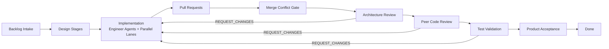

# Autonomous Delivery Team

Version: **v0.1.0**


An autonomous software delivery simulation platform that orchestrates role-based AI agents from backlog intake through production acceptance, with parallel engineer execution, governance gates, revision loops, and escalation/resume handling.

## Why This Matters

- Demonstrates how autonomous delivery can stay auditable, deterministic, and review-driven.
- Shows practical patterns for multi-agent coordination, not just single-agent code generation.
- Bridges autonomous implementation with governance gates, escalation, and human intervention.
- Provides a concrete reference implementation for agentic SDLC experimentation.

## What This Project Does

- Runs a multi-stage delivery workflow with role-specialized agents.
- Executes **parallel engineer agents** in **parallel lanes** during implementation.
- Produces real artifacts, event logs, and state snapshots for each run.
- Enforces review gates (including merge-conflict and test-validation checks).
- Supports escalation and human-guided resume flows.
- Provides a Streamlit dashboard for end-to-end visibility.

## Workflow Stages

`BACKLOG_INTAKE → PRODUCT_DEFINITION → REQUIREMENTS_ANALYSIS → ARCHITECTURE_DESIGN → IMPLEMENTATION → PULL_REQUEST_CREATED → MERGE_CONFLICT_GATE → ARCHITECTURE_REVIEW_GATE → PEER_CODE_REVIEW_GATE → TEST_VALIDATION_GATE → PRODUCT_ACCEPTANCE_GATE → DONE`

## Quick Architecture Diagram



## Quick Start

### 1) Create environment and install dependencies

```powershell
python -m venv .venv
.venv\Scripts\activate
pip install -r requirements.txt
```

### 2) Run acceptance scenarios

```powershell
$env:PYTHONPATH='src'
python scripts/demo_acceptance.py
```

### 3) Launch dashboard (workflow + UI)

```powershell
.venv\Scripts\python.exe ui/launcher.py
```

### 4) UI only

```powershell
.venv\Scripts\python.exe ui/launcher.py --ui-only
```

## Common Commands

- Run escalation demo:
  - `python ui/launcher.py --escalation-demo`
- Run resume e2e test:
  - `python scripts/demo_resume_e2e.py`
- Run engine directly:
  - `python -m ai_software_factory`
- Run dashboard directly:
  - `streamlit run ui/app.py`

## Repository Layout

```text
autonomous_delivery/
├── src/ai_software_factory/   # Core engine, agents, workflow, persistence
├── ui/                         # Streamlit dashboard and launcher
├── scripts/                    # Acceptance and escalation demo scripts
├── seed_repos/                 # Seed scenarios used by the engine
├── docs/                       # Architecture and operational docs
├── CHANGELOG.md                # Release history
├── VERSION                     # Current release version
└── requirements.txt            # Python dependencies
```

## Documentation

- Architecture: `docs/ARCHITECTURE.md`
- Requirements: `docs/REQUIREMENTS.md`
- Getting Started: `docs/GETTING_STARTED.md`
- Operations Runbook: `docs/OPERATIONS.md`
- Contributing: `docs/CONTRIBUTING.md`
- Roadmap: `docs/ROADMAP.md`
- Release Notes: `docs/RELEASE_NOTES_v0.1.0.md`
- Screenshots Guide: `docs/SCREENSHOTS.md`
- Changelog: `CHANGELOG.md`

## Screenshots

For external viewers, include dashboard screenshots under `docs/assets/screenshots/` using the naming guidance in `docs/SCREENSHOTS.md`.

## Configuration (Environment Variables)

- Core
  - `PYTHONPATH=src`
  - `ASF_SEED_REPO` (`fake_upload_service|simple_auth_service|data_pipeline`)
- Persistence
  - `ASF_PERSISTENCE_BACKEND=sqlite`
  - `ASF_SQLITE_PATH=generated_workspace/asf_state_ui.db`
- Optional Git source
  - `ASF_REPO_URL`
  - `ASF_REPO_REF`
- Resume from escalation
  - `ASF_RESUME_WORKFLOW_ID`
  - `ASF_HUMAN_RESPONSE`
  - `ASF_RESUME_STAGE` (e.g., `IMPLEMENTATION`, `MERGE_CONFLICT_GATE`, `TEST_VALIDATION_GATE`)
  - `ASF_RESUME_RESPONDER` (identity recorded in HumanIntervention)
  - `ASF_RESUME_MAX_STEPS` (safety limit for post-resume transitions)
- Optional LLM support
  - `LLM_API_KEY`
  - `LLM_API_PROVIDER` (`openai|anthropic`)
  - `LLM_MODEL`

## Release

This repository is prepared for external viewing as **v0.1.0**.
See `CHANGELOG.md` and `docs/RELEASE_NOTES_v0.1.0.md` for details.