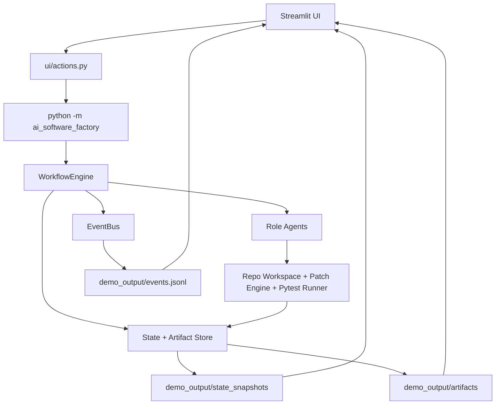

# Architecture

The Autonomous Delivery System is developed in the repository [obizues/Autonomous-Delivery-Team](https://github.com/obizues/Autonomous-Delivery-Team) on the `main` branch.

## System Overview

Autonomous Delivery System is a multi-agent, demo-ready, role-based workflow engine with observable execution artifacts, robust test isolation, and a Streamlit UI supporting step-by-step visual playback, live event feed, and artifact/PR drilldown.

```text
UI (Streamlit)
  ├─ reads artifacts/events/snapshots from demo_output
  └─ launches engine runs via subprocess

Engine (ai_software_factory)
  ├─ WorkflowEngine (state machine + transitions)
  ├─ Agents (role actions)
  ├─ Persistence (in-memory or SQLite)
  ├─ EventBus (audit stream)
  └─ Execution (repo workspace, patching, pytest)
```

## Repository References
- Repo: obizues/Autonomous-Delivery-Team
- Branch: main
- Owner: obizues



## Core Modules

- `src/ai_software_factory/workflow/`
  - `engine.py`: orchestration loop and review-gate control flow.
  - `transitions.py`: canonical stage sequence and role routing.
- `src/ai_software_factory/agents/roles/`
  - `product_owner.py`, `business_analyst.py`, `architect.py`, `engineer.py`, `test_engineer.py`.
- `src/ai_software_factory/execution/`
  - repo cloning/copying, patch engine, test execution.
- `src/ai_software_factory/persistence/`
  - in-memory and SQLite stores for workflow state and artifacts.
- `src/ai_software_factory/events/`
  - event model + bus for auditability.
- `ui/`
  - dashboard rendering and workflow launcher/actions.

## Stage Sequence

`BACKLOG_INTAKE → PRODUCT_DEFINITION → REQUIREMENTS_ANALYSIS → ARCHITECTURE_DESIGN → IMPLEMENTATION → PULL_REQUEST_CREATED → MERGE_CONFLICT_GATE → ARCHITECTURE_REVIEW_GATE → PEER_CODE_REVIEW_GATE → TEST_VALIDATION_GATE → PRODUCT_ACCEPTANCE_GATE → DONE`

## Engineer Parallelism Model

During `IMPLEMENTATION`:

1. Planner produces target files/symbols.
2. Files are partitioned across `engineer_N` agents.
3. Each agent executes in an isolated lane workspace.
4. Lane results integrate into the shared sandbox.
5. Patch outcomes emit per-lane events (`PATCH_APPLIED`, `PATCH_ROLLED_BACK`).

Additional controls:
- Story slice assignment per lane.
- Cross-review matrix for peer review.
- Merge Conflict Gate for overlap/marker detection.

## Governance and Quality Gates

Review-style gates return `APPROVED` or `REQUEST_CHANGES` via `ReviewFeedback` artifacts.

If `REQUEST_CHANGES` is returned at a gate:
- Engine increments revision.
- Flow loops back to `IMPLEMENTATION`.
- Revision loop is logged through events.

Escalation occurs for stalled progress or regressions near revision limits.

## Persistence and Outputs

Per run output:
- `demo_output/<workflow_id>/artifacts/` (JSON + markdown)
- `demo_output/<workflow_id>/events.jsonl`
- `demo_output/<workflow_id>/state_snapshots/`
- `demo_output/latest/` alias/copy for dashboard convenience

Persistence backends:
- In-memory (default)
- SQLite (`ASF_PERSISTENCE_BACKEND=sqlite`)

## UI Architecture

The UI is modular and demo-ready, featuring:
- Step-by-step visual playback (Replay/Demo mode) of the full workflow
- Live event feed with plain-language explanations of each automation step
- Artifact/PR drilldown with agent attribution and code diffs
- 'How it Works' overlay and guided walkthrough for demoing automation
- Visual cause/effect links for automation triggers and results
- Demo scenario selector for end-to-end delivery examples
- Robust test isolation and error prevention

UI modules:
- `ui/app.py`: rendering and top-level flow
- `ui/config.py`: constants and labels
- `ui/loader.py`: cached data loaders
- `ui/query.py`: query helpers
- `ui/analytics.py`: derived insights
- `ui/actions.py`: run/resume subprocess actions

## Extension Points

- Add/modify stages: `domain/enums.py` + `workflow/transitions.py` + relevant role handler.
- Add new escalation policies: `workflow/engine.py`.
- Add new dashboard insights: `ui/analytics.py` + `ui/app.py`.
- Extend UI with new demo/visualization features as needed.
- Add additional seed scenarios: `seed_repos/` + runner/backlog mapping.
